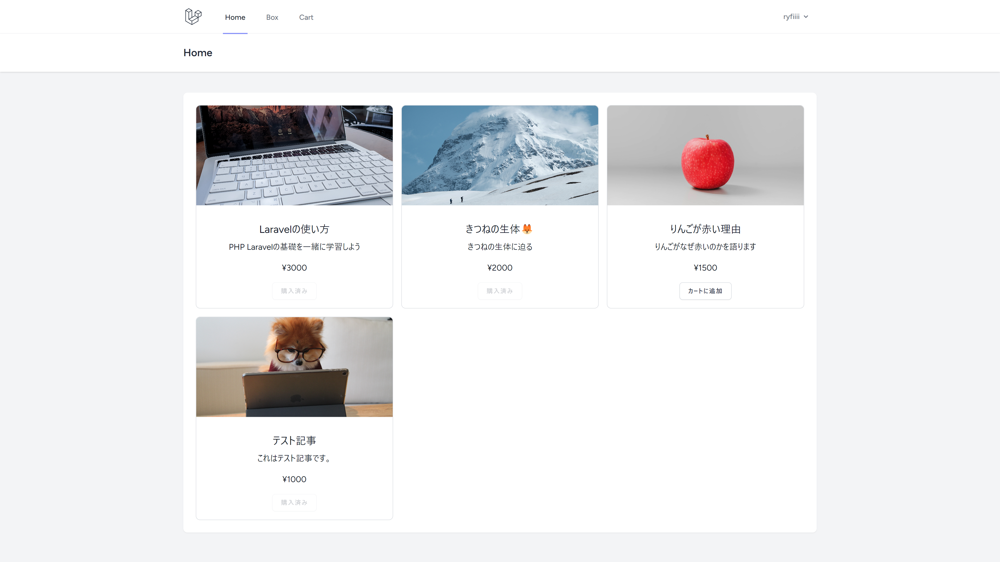
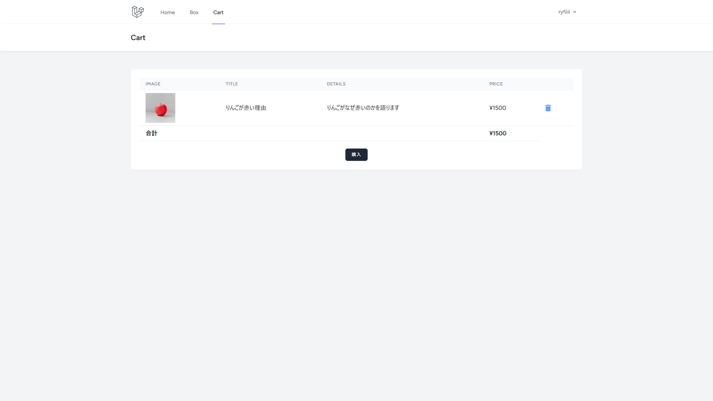
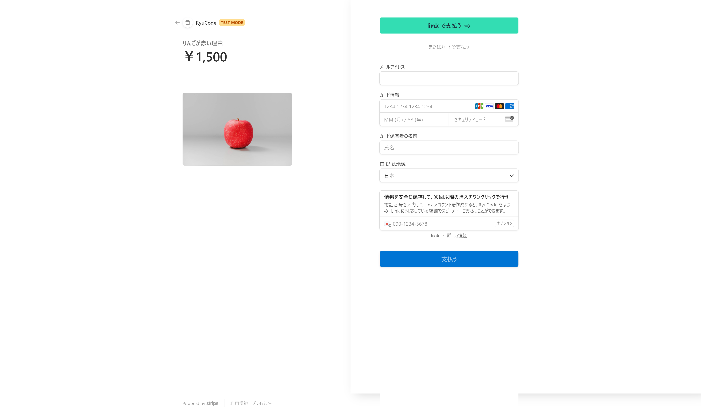
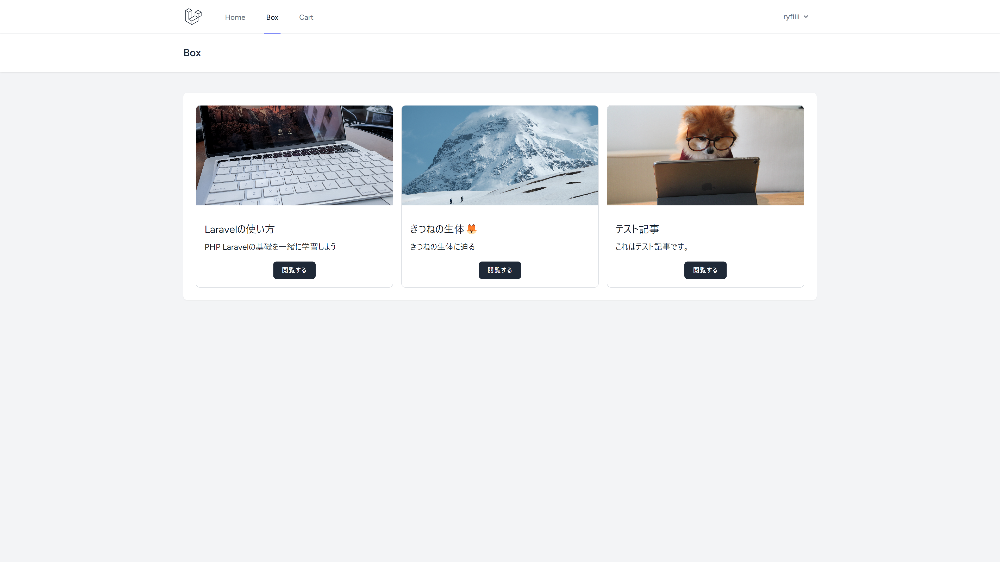
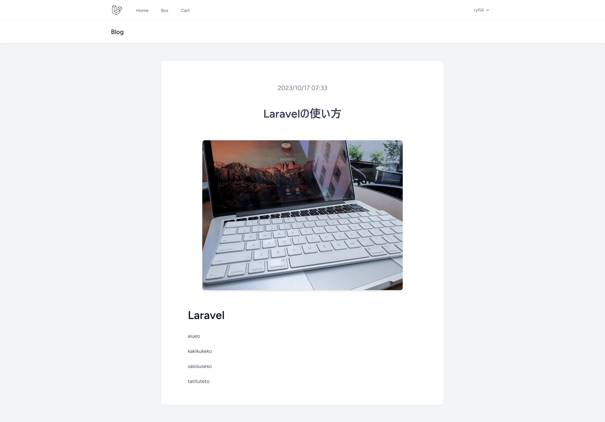

# 🚀 StripeBlog

StripeBlogは、記事の購入と閲覧ができるプラットフォームです。以下にその主な機能と画面のスクリーンショットを紹介します。

## 🏠 Home

ホーム画面では、販売している記事の一覧を閲覧できます。

## 🛒 Cart

カート画面で、カートに追加した記事の一覧と合計金額を確認できます。購入ボタンで決済画面に進みます。

## 💳 決済画面

決済画面で支払いを行い、記事を購入できます。

## 📦 Box

ボックス画面で、購入した記事の一覧を確認できます。

## 使用した技術スタック
- Laravel (フロントはBlade, バックはLaravel)
- Laravel Breeze (認証機能)
- Stripe Api (決済システム)
- WebHook ([Stripeでの購入処理が完了した時]というイベントをキャッチするため)

## 📖 ブログ画面

ブログ画面で、購入した記事の内容を閲覧できます。

